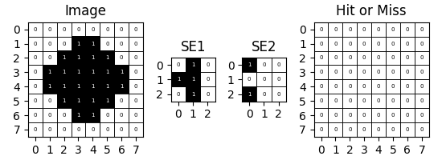

### `plot_morphology`

**Description**:  
`plot_morphology` is a utility function for visualizing grayscale morphological images with several customizable options, including grid overlays, pixel value display, and axis numbering. It allows fine-tuning of figure scaling, making it adaptable to various visualization needs.

**Function Signature**:

```python
def plot_morphology(images: List[Matrix], titles: List[str],
                    draw_border=True, show_numbers=False,
                    show_axis=False, figure_scale=0.7):
```

**Parameters**:

-   **`images`** (list of matrices):  
     A list of 2D arrays representing grayscale images. Each array is displayed as a separate subplot.

-   **`titles`** (list of str):  
     Titles corresponding to each image, appearing above each subplot.

-   **`draw_border`** (bool, default=True):  
     If `True`, draws a border grid around each pixel for clearer pixel boundary inspection.

-   **`show_numbers`** (bool, default=False):  
     If `True`, displays the value of each pixel inside its cell, useful for exact pixel inspection.

-   **`show_axis`** (bool, default=False):  
     If `True`, shows numbering on the x and y axes, which aids in locating specific pixel positions.

-   **`figure_scale`** (float, default=0.7):  
     A scale factor for adjusting the overall figure size. Valid values range from 0 to 1. Higher values increase the plot size.

**Usage Example**:

```python
from DIP.morphology import hit_or_miss

bit_dipth = 4

im = [[0,0,0,0,0,0,0,0],
      [0,0,0,1,1,0,0,0],
      [0,0,1,1,1,1,0,0],
      [0,1,1,1,1,1,1,0],
      [0,1,1,1,1,1,1,0],
      [0,0,1,1,1,1,0,0],
      [0,0,0,1,1,0,0,0],
      [0,0,0,0,0,0,0,0]]

se1 = [[0,1,0],
      [1,1,0],
      [0,1,0]]

se2 = [[1,0,0],
      [0,0,0],
      [1,0,0]]

result = hit_or_miss(im, se1, se2)

plot_morphology([im, se1, se2, result], ['Image', 'SE1', 'SE2', 'Hit or Miss'],
                draw_border=True, show_numbers=True, show_axis=True, figure_scale=0.5)
```



**Notes**:

-   The function applies a `gray_r` colormap, mapping `0` to white and `1` to black.
-   If only a single image is provided, it’s wrapped in a list to ensure compatibility.
-   For better performance with large images, consider setting `draw_border=False` or adjusting `figure_scale`.

**Dependencies**:  
you need to install `matplotlib` to use this plugin

```bash
python -m pip install matplotlib==3.9.0
```

**Returns**:  
This function does not return a value; it directly displays the plot using `plt.show()`.
